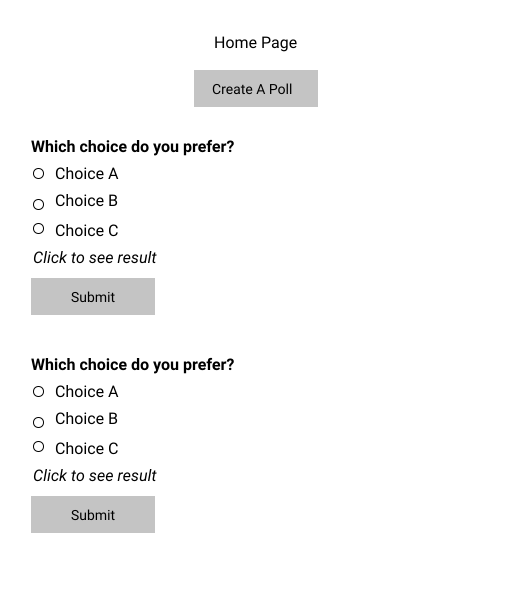
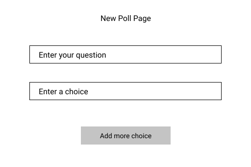
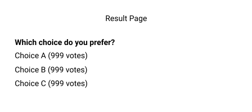

# Simple Poll App

## User Stories
- Users can create a poll with a multiple-choice question.
- Users can see a list of polls on the homepage and vote on them. But they can’t see the result.
- Users can click on the polls listed on the homepage to see the result.

## UI Mockups

## Basic Requirements
You can choose to implement either the Front-end or Back-end of the application.

### Front-end
- Implement the UI and its functionalities.
- Data can be stored in memory or local storage.

### Back-end
- Implement REST APIs for each functionality.
- Store data in a relational database.

## Advanced Requirements (Optional)
- Use Docker Compose to containerize the application.
- Implement unit tests to have more than 80% code coverage.
- Store data using a cloud service like AWS, GCP, Azure, etc.

## How To Submit
Upload your solution to a public git repository and share it with us.